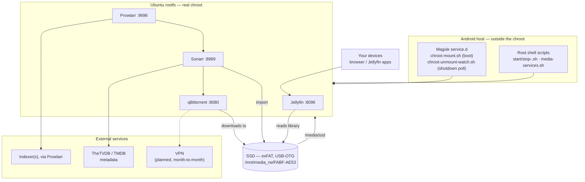
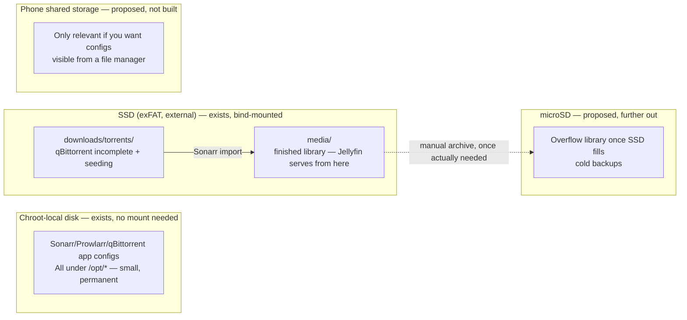

# Architecture — components and storage layout

> **Status update:** SABnzbd was tried, then removed. qBittorrent is now
> the active download client (installed via `apt install qbittorrent-nox`,
> wired up in `qbittorrent_scripts/`). Its VPN routing is still not set up.

See `README.md` for script-level detail.

---

## 1. System diagram — what's running now (+ what's planned)

Solid arrows are wired up today. Dashed arrows are planned (`README.md`
roadmap) — nothing dashed exists on disk yet.



**Reading it:** Magisk brings the base chroot mounts up at boot; everything
else is started manually (`README.md`), on purpose — the phone is a daily
driver, not a dedicated box. Sonarr never downloads anything itself: Prowlarr
hands it a search result, qBittorrent does the actual fetch, and Sonarr's own
job is "decide what to grab, then import the finished file into the
library." qBittorrent isn't yet routed through a VPN — still to do.

---

## 2. Storage layout — what exists vs. what's proposed



### Tier 0 — chroot-local disk (exists today, nothing to configure)

Where Sonarr, Prowlarr, and qBittorrent's **configs** live — `/opt/Sonarr/data`,
`/opt/Prowlarr/data`, `/opt/qBittorrent/data`. Small, permanent. This is just
the rootfs's own filesystem; there was never a mount step for any of it,
which is exactly why `start-prowlarr.sh` doesn't source `ssd-env.sh` the way
the Jellyfin/Sonarr/qBittorrent scripts do — Prowlarr never touches media or
downloads at all.

qBittorrent's actual downloads went to the SSD, not chroot-local disk —
resolved the same way SABnzbd's was: the phone's own free space (~30 GB)
can't reliably hold what a torrent needs, and unlike a Usenet download,
torrents often need to keep **seeding** after "complete," so the data lives
there longer, making the capacity argument even stronger than it was for
SABnzbd.

### Tier 1 — SSD (`/mnt/media_rw/FABF-AE53` on host → `/media/ssd` in chroot)

The existing convention (see the `scp` example in `README.md`, which already
lands things under `media/tv`) extended to the rest of the library, plus the
downloads tree:

```
FABF-AE53/                     (chroot view: /media/ssd)
├── media/
│   ├── movies/
│   ├── tv/
│   ├── music/                 # if Lidarr ever gets added
│   └── other/                 # not pursued
└── downloads/
    └── torrents/               # qBittorrent — incomplete/, seeding/
                                 # (kept named by purpose/transport, not app,
                                 # in case the client ever changes)
```

Same exFAT tradeoffs SABnzbd hit apply here too (no hardlinks, no sparse
files, restricted filenames) — accepted for the same reason: capacity beats
performance on a 30 GB phone.

**Correction to the earlier SABnzbd-era advice:** that said to turn "Use
Hardlinks" off so imports become a free same-filesystem rename. That's
**wrong for torrents** — unlike a Usenet download, qBittorrent needs the
file to keep existing at its seeded path to keep seeding. A rename would
move it out from under qBittorrent and break seeding. Leave "Use Hardlinks"
**on** in Sonarr (it'll try, fail silently on exFAT since there's no
hardlink support, and fall back to a real copy) — meaning anything still
being seeded effectively costs double space (qBittorrent's copy +
the library copy) for as long as you seed it. Real, ongoing cost torrents
have that Usenet never did.

### Tier 2 — phone shared storage (proposed, not built)

Not the same thing as Tier 0. This is Android's shared internal storage —
what a file manager calls "Internal storage," `/storage/emulated/0` (a.k.a.
`/sdcard`) — visible outside the chroot, unlike Tier 0. Only worth building
if you want downloads/configs visible from a normal Android file manager, or
need to move them off the chroot's partition for space. Nothing today
depends on this; skip it unless a concrete reason comes up.

### Tier 3 — microSD (proposed, further out)

Only relevant if a card is actually seated in the Poco X3 NFC's hybrid tray.
Android assigns it its own volume path — find it with `ls /storage/` once one's
inserted. Treat it as a manually-managed release valve, not another automated
import target — Sonarr should keep exactly one root folder
(`/media/ssd/media/...`) so it always knows where "the library" is.

---

## Open questions

- [ ] VPN not yet chosen/configured.
- [ ] Tier 2/3 remain unbuilt — revisit only if a concrete need shows up
      (visibility from a file manager, or the SSD actually filling up).
